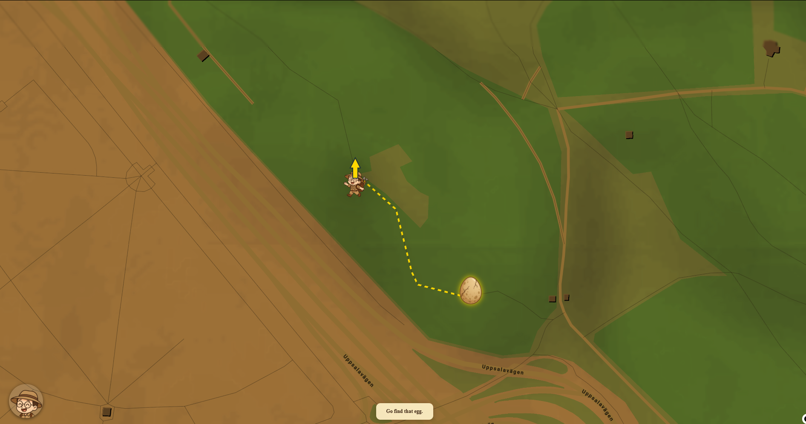

[](https://github.com/fazlizekiqi/dinosaur-card-collector/actions/workflows/deploy.yml)
# Dinosaur Card Collector

Preview: 

https://fazlizekiqi.github.io/dinosaur-card-collector/ 


Dinosaur Card Collector is a web-based game where users collect, trade, and view digital dinosaur cards. The game features a standalone interface, vibrant visuals, and a fun card-collecting experience for all ages.

## Features

- **Collect Dinosaur Cards:** Discover and collect unique dinosaur cards.
- **Trade Cards:** Exchange cards with other players to complete your collection.
- **Visual Gallery:** View your cards in a dynamic gallery.
- **Progress Tracking:** Track your collection progress and achievements.

## Game Visualization



*Above: Example of the card gallery interface, showing collected dinosaur cards and user stats.*

## Getting Started

### For Users

1. Open the game in your browser at `/dinosaur-card-collector/index.html`.
2. Start collecting cards by exploring the game.
3. Trade cards and view your collection in the gallery.

### For Developers

#### Prerequisites

- Node.js 20.19.0 and npm installed

#### Installation

```bash
  npm install
```

#### Development
```bash
  npm run dev
```

